A useful way to think about apps is through the way users interact with them. Two very basic levels of interaction are **viewing** and **editing** data. But very often, apps need to be able to perform Actions.

For example, in this app, there is a [Button](/docs/button-component) which, when clicked, will take people to a website. This is because the button has the action [Open Link](/docs/open-link).

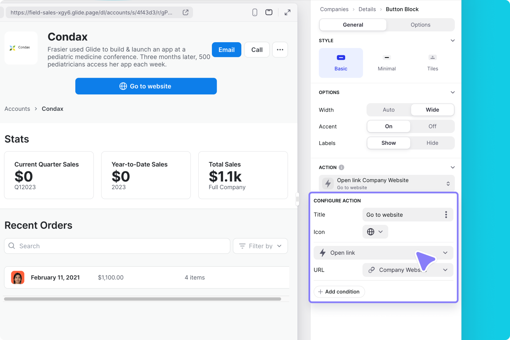

You may not have thought of it this way before, but opening a [Form](/docs/forms) is a type of Action. If you look closely in the [Form Button](/docs/form-button)'s configuration, you will see the Action 'Show Form' enabled.

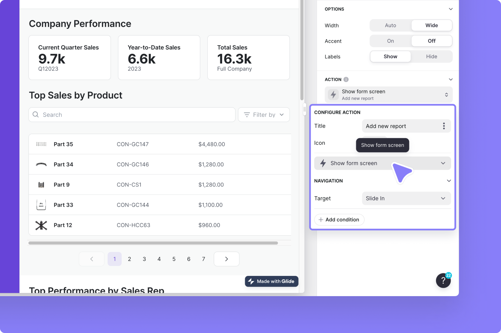

Open Link and [Show Form Screen](/docs/show-form-screen) are examples of native Glide Actions. In other words, they trigger things that happen in your app. But you can also Integrate third party Integrations like Slack, Outlook, or OpenAI into Glide and trigger messages, emails, generated text and much more. 


 
## The Action Editor

As you can see in the images above, it's possible to manually add actions to components. However, Glide also has an Action Editor that allows you to save and reuse actions and combine them into more complex workflows.

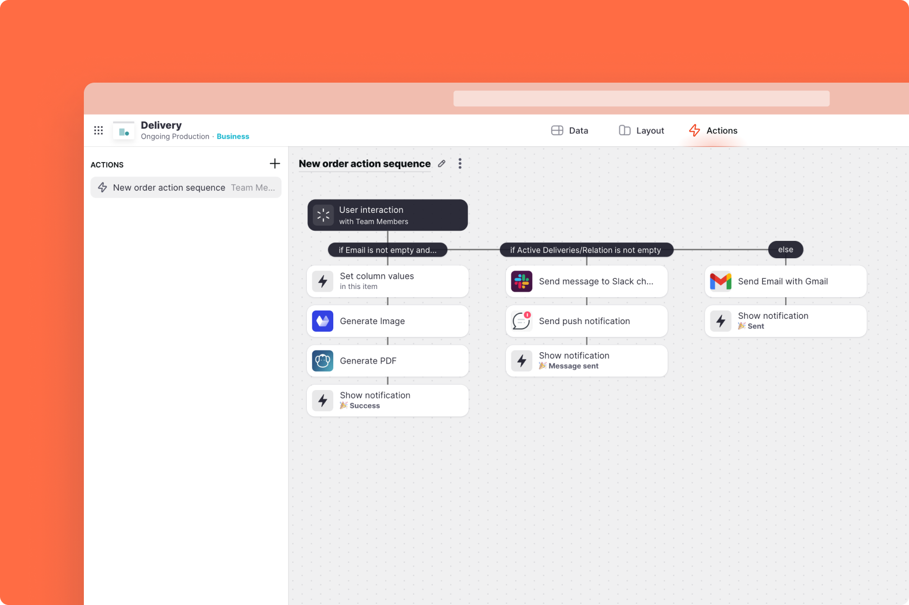

## Creating Actions

Navigate to the Action Editor by clicking on the third and final icon in the middle of the top bar. 

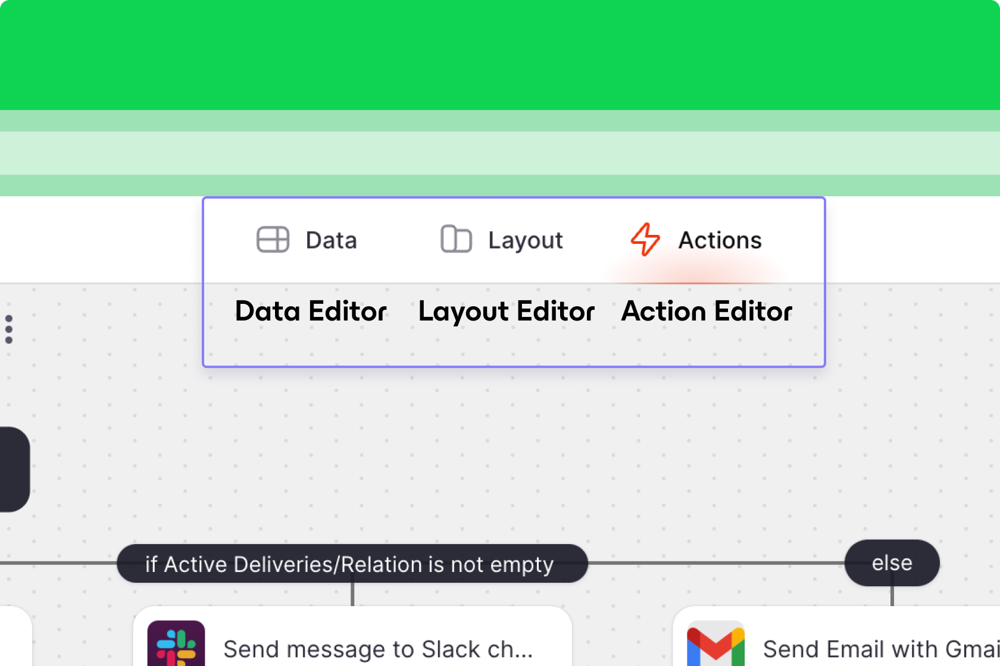

If your app already has actions or you have created actions in the Layout Editor, they will automatically be listed in the left sidebar. Clicking on an action will load it in the Action Editor on the right.

To create a new action, click the plus icon in the top left corner. You will be prompted to choose a data source table for your action.

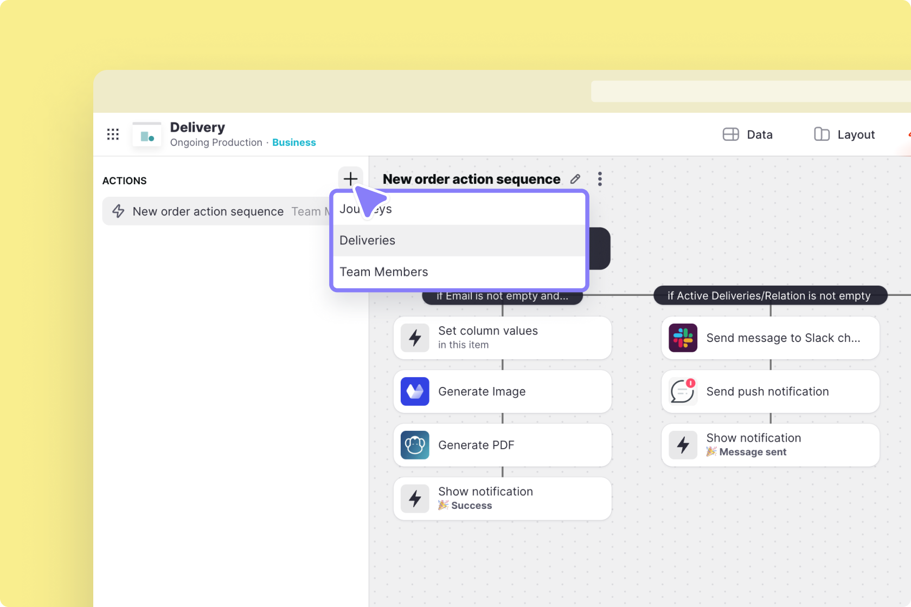

## Data Source

The data source table you choose for an action determines where that action can be used. 

For instance, suppose you want to create an action where a user can tap a button on an inventory item and automatically send an email to an admin. The email should indicate that the stock level is low and include the current stock level.

For this particular action to work, it needs to know what stock item it is and the current stock level. So this action must be made with the Inventory table as the source. 

This also means that this action cannot be triggered on a screen that has a different table. For example, it would not make sense to trigger this action on a Team Member’s profile. 

This means that although actions are reusable, they are only reusable on screens that have the same data source.

## Re-using Actions

Once you create an action, you can reuse it in any part of your app as long as the data source for the screen containing the action is the same as the action's data source.
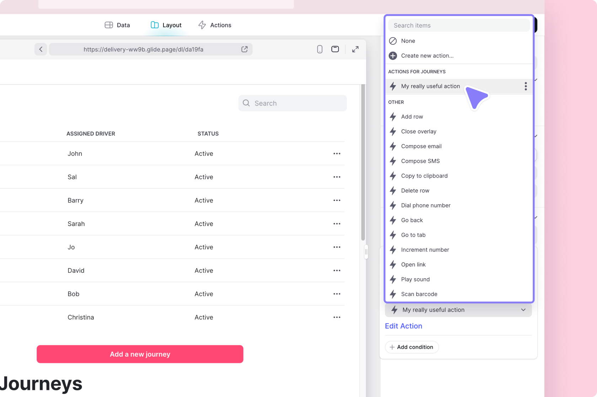

## Sequences

You can have single step actions, or you can have multi-step actions. This means multiple things will happen when your action is triggered. 
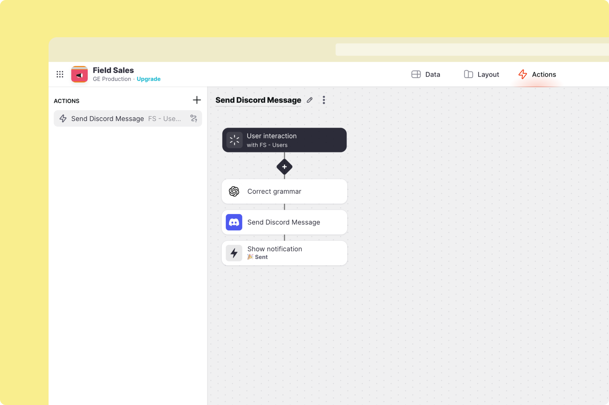

To add new actions to the flow, hover just underneath an action and click the plus button.

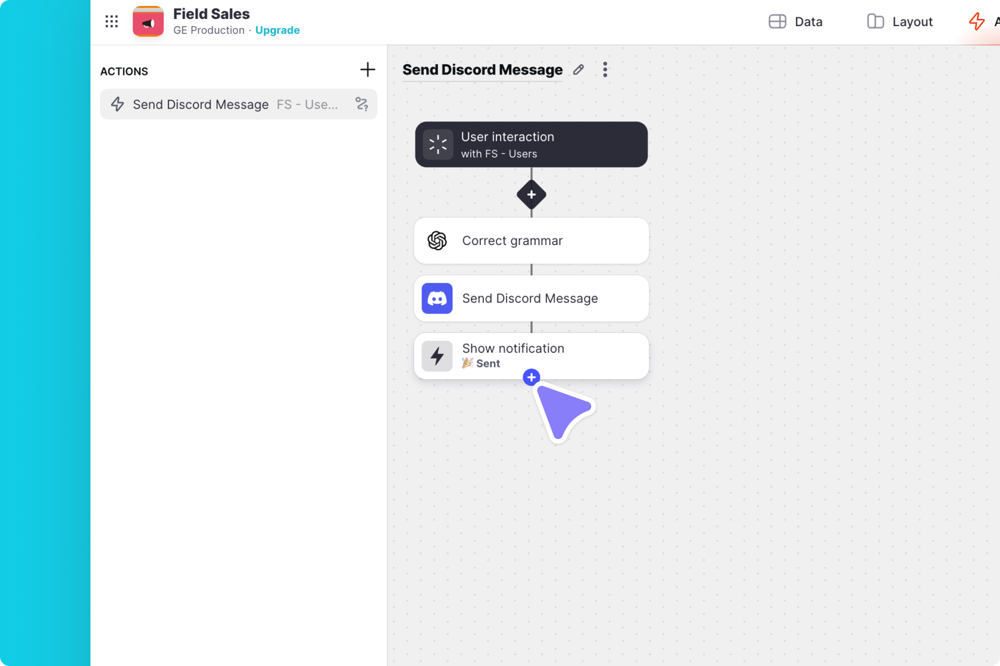

To edit actions, click on the action.

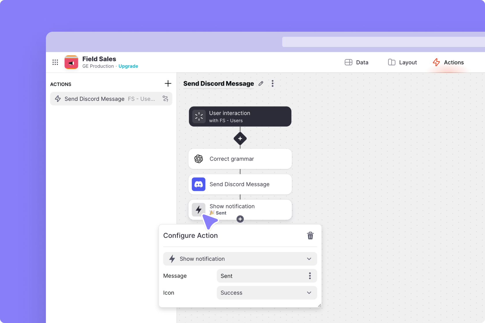

To re-order actions, click and drag the action.

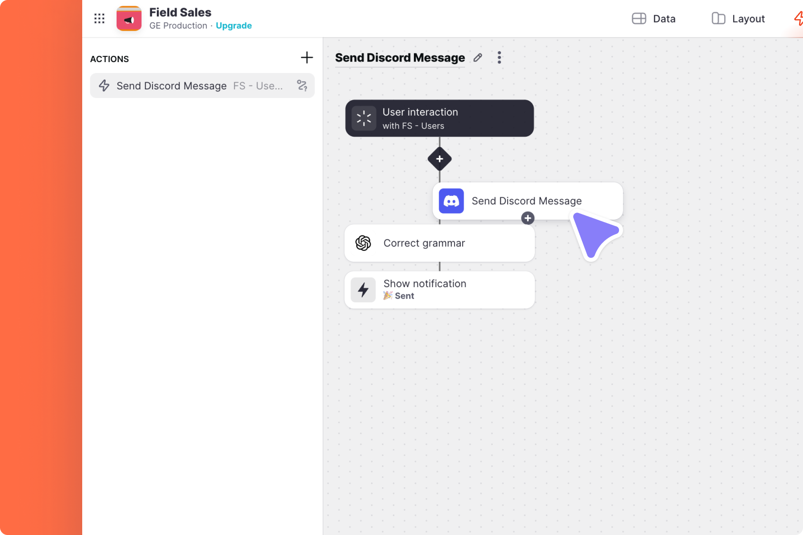

To delete actions, open the action, and click the trash icon.

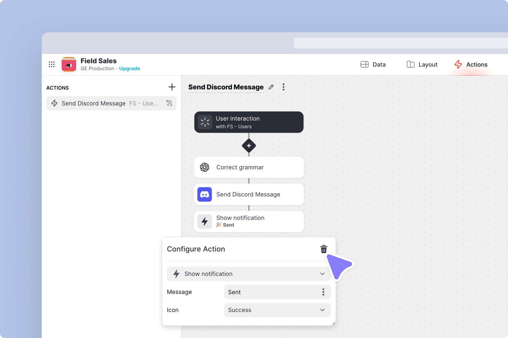

## Conditions

You may want only a single sequence of actions to be triggered each time, but sometimes you'll want to create different scenarios where different actions happen depending on conditions you set. Therefore, the second dimension in building custom actions is working with **Conditions**.

To add a condition to one of your sequences, click the plus icon at the top of a sequence.

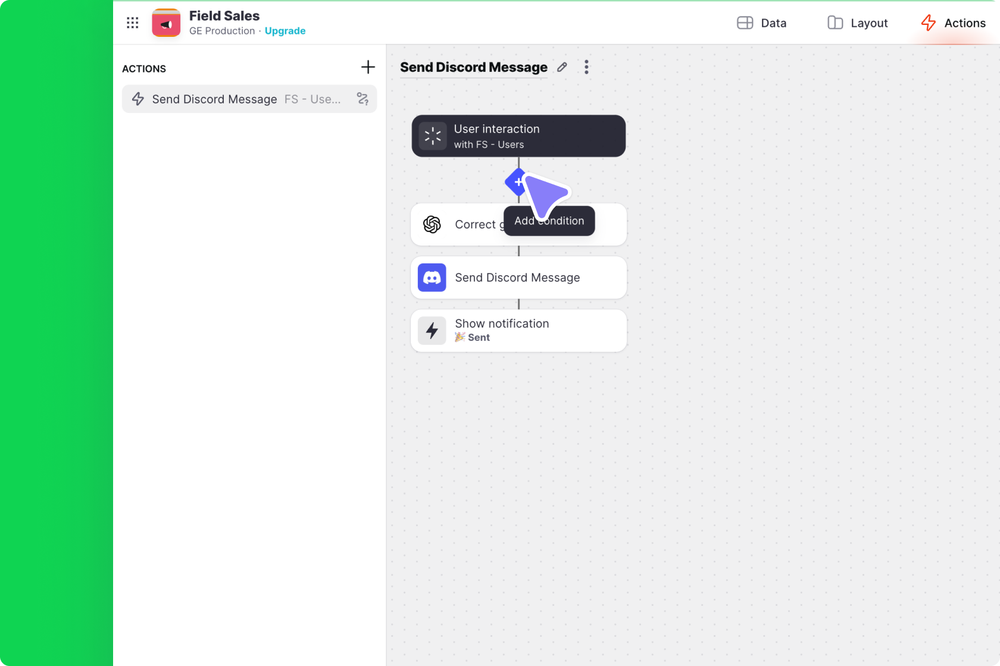

The conditions you set determine when the following action sequence will run. If the condition is not met, the action sequence won't run.

If you don't want the action to do nothing, you'll need to create an alternate action to run if the initial condition is not met.

To do this, add an 'Else' statement to your condition. With an else statement, if the first condition in the action editor is not met, the actions under the else section will be triggered.

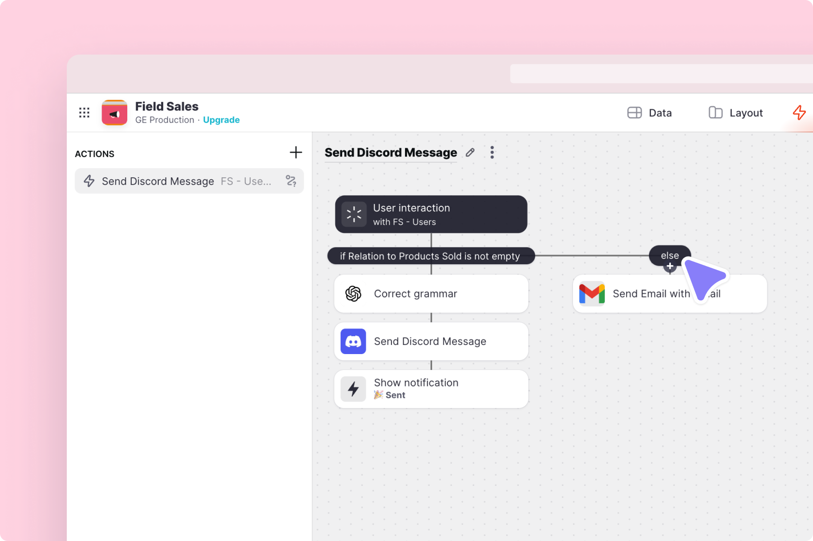

You can add many different conditions to your action.

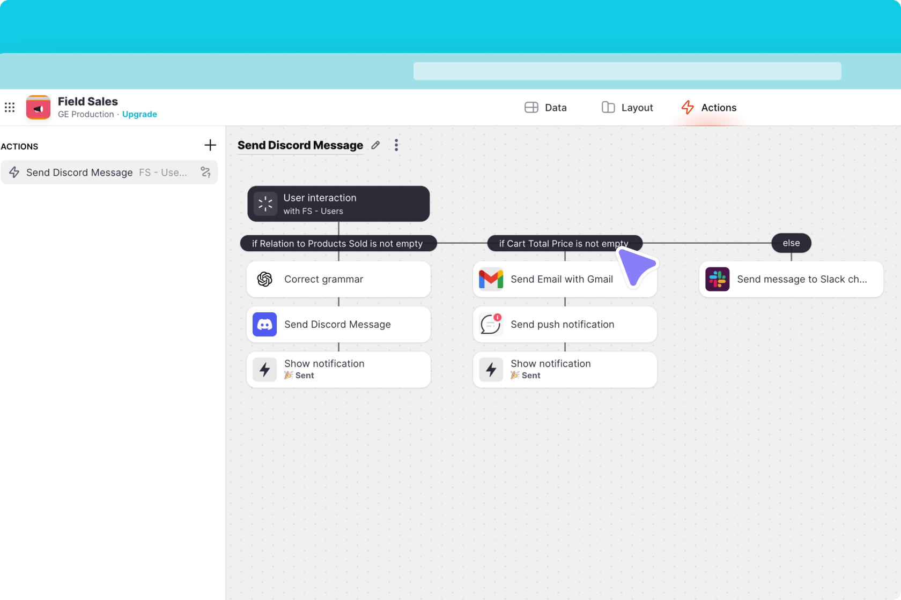

## Types of Actions

There are two main types of actions: Integration Actions and Glide Actions. 

### Integration Actions

Some Integrations come with actions that you can trigger in Glide. For example, the Slack integration makes it possible for you to trigger a Slack notification from a Glide Action. 

To learn more about Integrations, check out our Integrations Docs. 

### Glide Actions

Glide Actions are actions that affect only things within your app. Most of them do not communicate with the outside world. Examples include adding a row, opening a link, navigating to a tab, and returning to a previous screen. 

Mostly, they fall into four categories.

1. Data
2. Navigation
3. Communication
4. Advanced

Data Actions use or change data. These include things like

- [Add Row](https://www.glideapps.com/docs/add-row)
- [Set Column Values](https://www.glideapps.com/docs/set-column-values)
- [Upload image](https://www.glideapps.com/docs/upload-image)
- [Copy to Clipboard](https://www.glideapps.com/docs/copy-to-clipboard)

Navigation Actions show or move users to different screens. For example:

- [Go to Tab](https://www.glideapps.com/docs/go-to-tab)
- [Go Back](https://www.glideapps.com/docs/go-back)
- [Show Notification](https://www.glideapps.com/docs/show-notification)
- [View Address on Map](https://www.glideapps.com/docs/view-address-on-map)
- [Show Edit Screen](https://www.glideapps.com/docs/show-edit-screen)

Communication actions trigger things like emails, text messages, and phone calls.

## Action Locations

There are many places where you can add Actions in your app. 

### Component actions

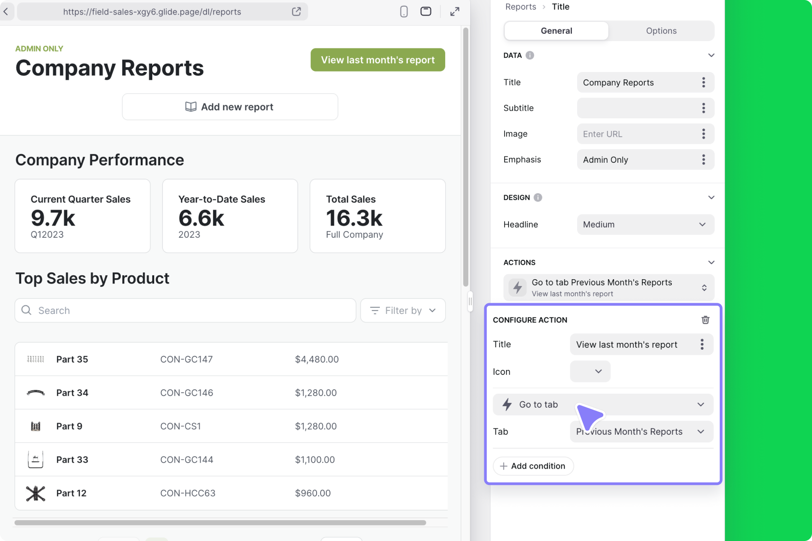

Some [Components](/docs/components) have Actions, and some do not. If a Component has the option for an Action, you'll see it in the component's configuration.

Some components, like the Collection component have multiple actions you can add.  
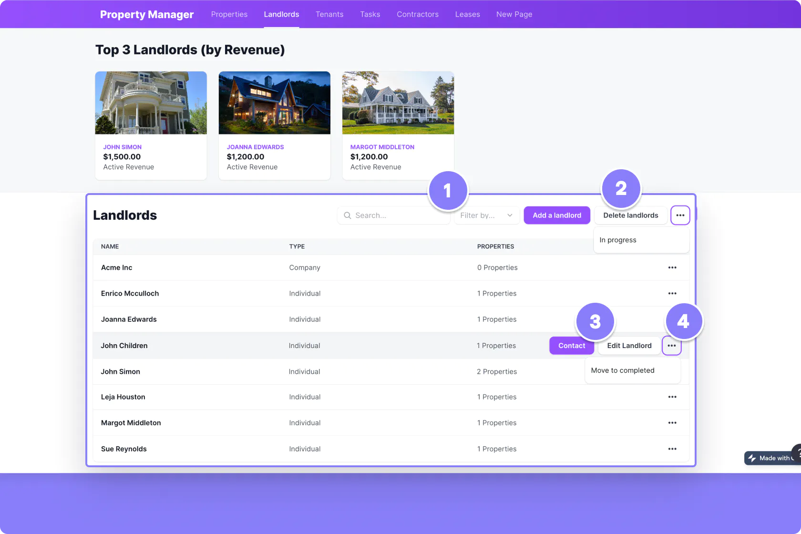

The full list of components that have actions (at the time of writing) is:

- Collection
- Title
- Button
- Image
- Action row
- Contact
- Rich text
- Hint

### Item Click Actions

The default action for clicking on a list item in a collection is to view that item's [Details Screen](/docs/screens#details-screen). This behavior is so common that you may not have thought of it as an action before.

However, you can change this to a number of other actions. For example, you could:

- A list of contacts that when tapped, triggers the [Dial Phone Number](/docs/dial-phone-number) action.
- A list of inventory items that, when tapped, changes the number in the inventory.
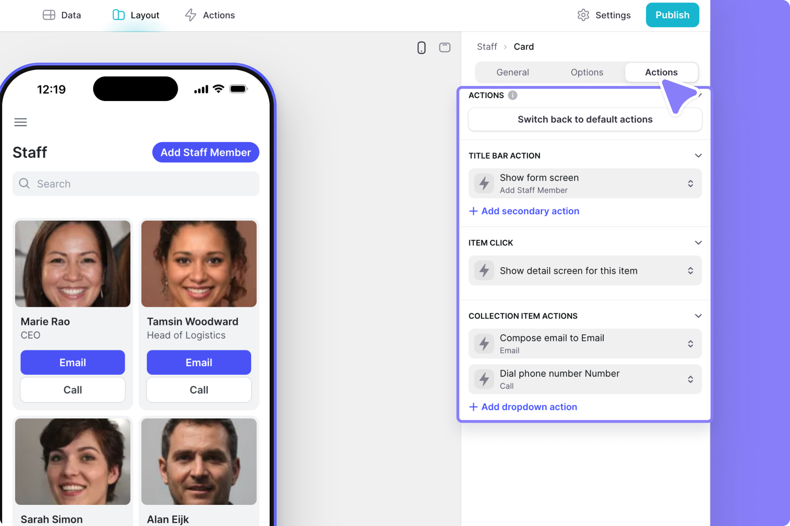

### After Submit Actions
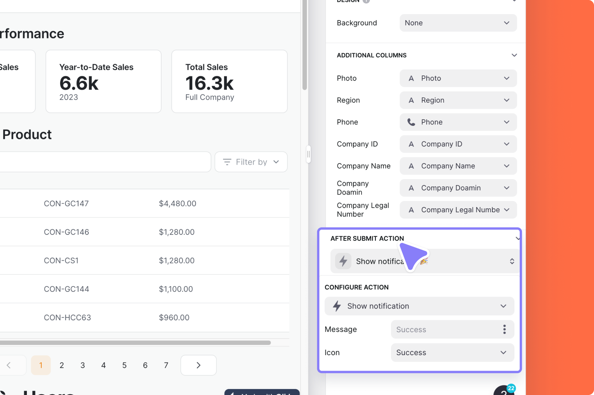

Another type of Action is the After Submit Action. After users add/edit or submit Forms — you have the option to add Actions that trigger on submit.

For example, you could create an action that notifies your Slack channel every time a form is submitted. 

## Automations

While you can create multi-step actions and set conditions within a single ‘action’ — this is different to automations. 

Automations are a series of interdependent actions that achieve a specific goal without requiring constant user input. For example, you might want to run an action at a specific time every night or trigger an event every time a new row is added, or data meets a certain criteria. 

Glide does not have these automation capabilities yet, but we will add this functionality soon. 

## Recent Runs

If you are having trouble with your action or want to inspect its activity, you can look at the ‘Recent Runs’ tab in the Action Editor. 

Here, you’ll see all the times your action has fired in the last 30 days and information about the run. This is currently an experimental feature, so please let us know if you encounter issues.