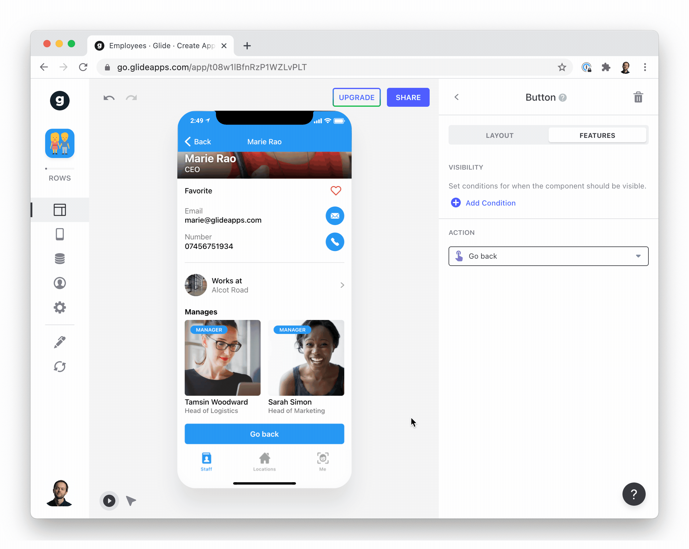

The Go Back action works exactly like the back button in the top left of an app. It moves the user back to whatever screen they were on before.

On its own, it is not that useful, but can be very helpful in [Custom Actions](/docs/actions) workflows.